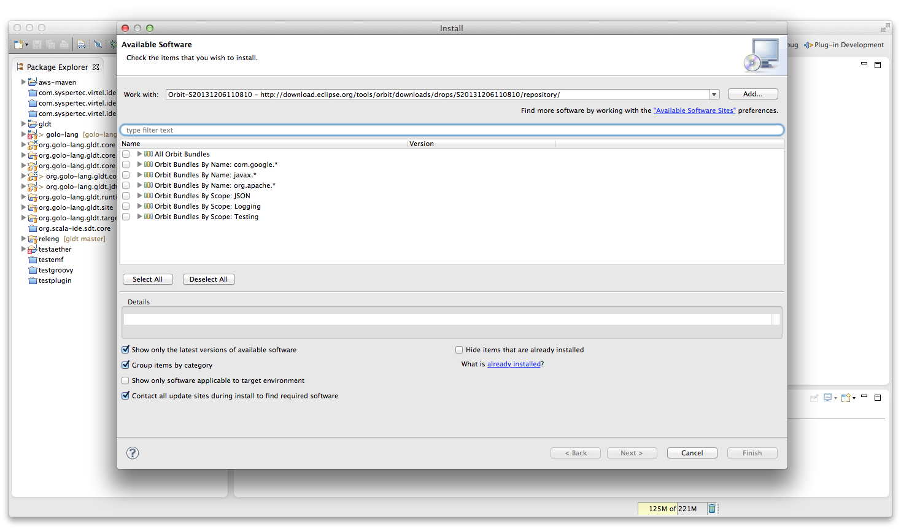
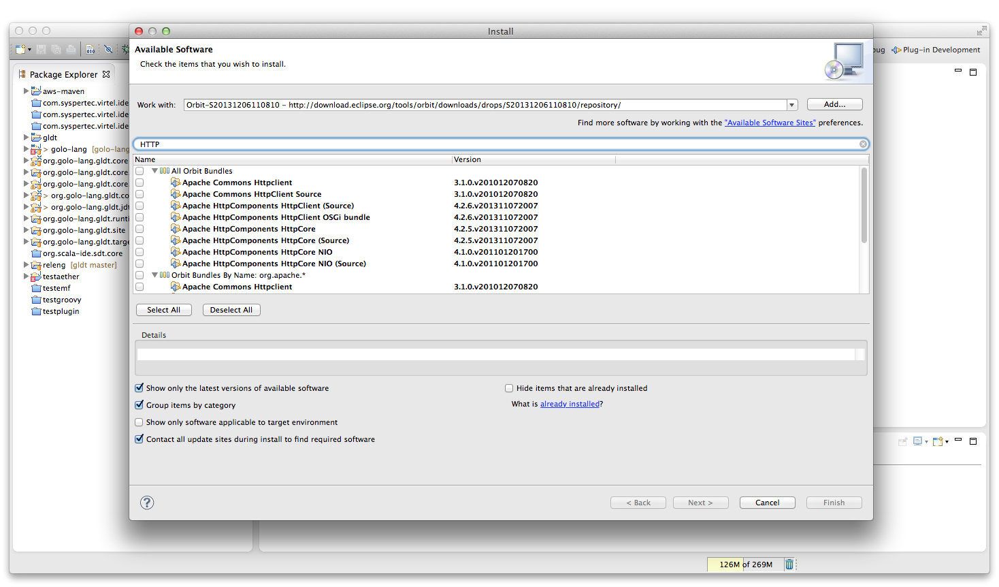
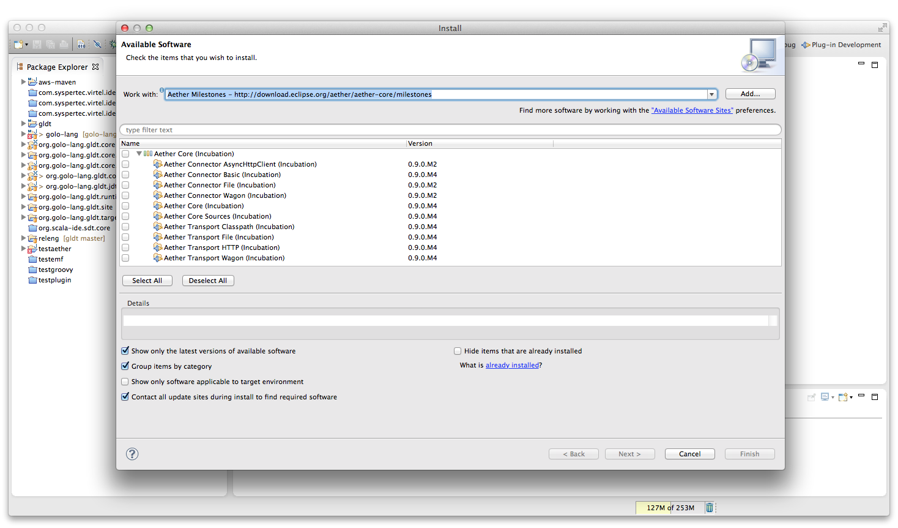
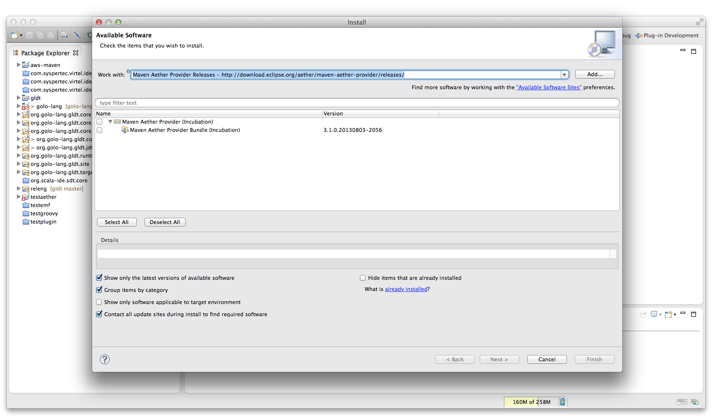

gldt
===

Golo Language Development Tools (Eclipse)

##**Manual installation**

Once you've cloned the repository, run mvn package.

This should produce an update site under org.gololang.gldt.site/target/repository.

Under Eclipse, add this folder as a local software site and give it a name (GLDT for example).

Then, click on **Help -> Install new software**, and select the software site you just created.

After a short time, you should see two items, **GLDT** and **Xtext**.

If Xtext is not installed on your Eclipse, select the two items and proceed to the installation.

If Xtext is already installed on your Eclipse, select only the **GLDT** item and proceed to the installation.

Restart Eclipse.

GLDT should be installed and the GDLT editor should be run on each .golo file.

##**Automatic installation**

Under Eclipse, click on **Help -> Install new software**, and enter the *http://gldt-update-site.golo-lang.org/nightly* URL and hit the Enter key.

After a short time, you should see GLDT displayed in the tree, select it and click on the **Next** button. When the feature Golo Development Toolkit Core is displayed, click on the **Next** button, accept the license agreement and click on the **Finish** button. Restart Eclipse.

GLDT should be installed and the GDLT editor should be run on each .golo file.

##**<a name="JDT">JDT Integration</a>**

GLDT now integrates with Eclipse JDT. If you create a Java project and set the Golo nature, then each .golo file that is located into one of the Java source folders with gets compiled.

However, GLDT does not embed the Golo compiler as Golo is changing today at a high pace. So you must download yourself the Golo jar file and set it in your project classpath. If the Golo jar file is not in your project classpath, then compilation of the .golo files with failed and you will get a dialog error.

To set the Golo nature to your Java project, right click on your project, and select **Configure -> Add Golo nature**

##**<a name="Aether">Aether installation</a>**

If you want to use the latest bits of the Golo runtime, then you need to install Eclipse Aether into your Eclipse instance. Please follow the procedure given below in order to install Eclipse Aether.
### HTTP Client
The first component that is to be installed is the HTTP Client from apache.org. Although there may be bundled with your Eclipse installation, Eclipse Aether requires a quite recent version of this component. It is available on a stable build of the Eclipse Orbit project.

In order to install it, click on **Help -> Install new software**, then click on the **Add** button, and enter the following URL in the **Location** field: http://download.eclipse.org/tools/orbit/downloads/drops/S20131206110810/repository/

After you've pressed the **OK** button, you should see the following image:

Enter the string **HTTP** in the **Filter** field, you should have the following image:

Select the following components (Source components are optional):

* Apache HttpComponents HttpClient OSGI bundle
* Apache HttpComponents HttpCore
* Apache HttpComponents HttpCore NIO

then click on the **Next** and **Finish** buttons and restart Eclipse when asked.
## Aether core
Once you've installed the HTTP Client, you must now install Eclipse Aether core.
In order to install it, click on **Help -> Install new software**, then click on the **Add** button, and enter the following URL in the **Location** field: http://download.eclipse.org/aether/aether-core/milestones/
After you've pressed the **OK** button, you should see the following image:

Select all components except the first one (Aether Connector AsyncHttpClient), then click on the **Next** and **Finish** buttons and restart Eclipse when asked.
## Maven Aether provider
The last component to install is the Maven Aether provider.
In order to install it, click on **Help -> Install new software**, then click on the **Add** button, and enter the following URL in the **Location** field: http://download.eclipse.org/aether/maven-aether-provider/releases/
After you've pressed the **OK** button, you should see the following image:

Select the single component, hen click on the **Next** and **Finish** buttons and restart Eclipse when asked.
You've completed the installation of Eclipse Aether !!!

**IRC**

Log into the #gldt IRC channel on irc.freenode.net or with <a href="http://webchat.freenode.net">web irc client</a> 

 https://travis-ci.org/golo-lang/gldt
